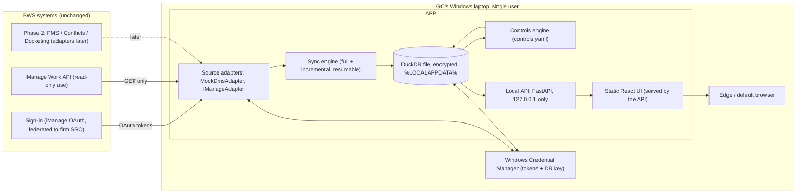

# Architecture: BWS DMS Risk Analytics

Read with `DIAGNOSIS.md` (why), `DECISIONS.md` (choices), `data-model.md`
(storage) and `api-contract.yaml` (the interface between the backend and
the frontend).

## 1. Shape

The whole app is a single process on the laptop. The browser is only a
window onto `http://127.0.0.1:<port>`. Nothing listens on the network, and
nothing is sent anywhere except **GET** requests to iManage and the sign-in
service.

## 2. Components

| Component | Responsibility | Notes |
|-----------|----------------|-------|
| `DmsAdapter` (interface) | `list_libraries`, `iter_workspaces(since)`, `iter_documents(workspace, since)`, `iter_folders(workspace)`, `get_versions(doc)` (optional), `current_user()`, `capabilities()` | Async iterators with paging handled inside. `capabilities()` says what the source supports (for example `history: false`), so that metrics can degrade gracefully |
| `MockDmsAdapter` | A deterministic synthetic firm (seeded) | The default mode. All development and tests use it. Everything in it is obviously fake |
| `IManageAdapter` | iManage Work REST API v2 | Delegated OAuth, GET-only allow-list, backoff, paging. See §4 |
| Sync engine | Full first sync, then incremental by modified-date watermark per library. Checkpointed and resumable. Can be cancelled. Reconciles access loss (see §5) | One sync at a time |
| Store | DuckDB file with migrations | Encrypted with a key held in Credential Manager (see `DECISIONS.md` D4) |
| Controls engine | Evaluates `controls.yaml` against stored metadata and writes `control_result` rows. Pure SQL and Python, no network | Re-runs after each sync or config change |
| Local API | Implements `api-contract.yaml` and serves the built UI | Security in §6 |
| UI | React SPA: portfolio, controls, matters, exceptions, Lexcel sampling, sync and settings | Built by agent 3, served as static files |
| Launcher | `dms-analytics.exe` starts the server, opens the browser to a one-time launch URL, and exits when the window closes or idles | Packaged with PyInstaller (D6) |

## 3. Controls catalogue (phase 1, iManage filing evidence)

All thresholds and document-class mappings come from `controls.yaml`
(firm-configurable, shipped with defaults). "Substantive document" means
the earliest document whose class is **not** in `intake_classes`. Every
result records its **evidence document IDs** and its **basis**
(`imanage_filing`).

Result statuses: `pass`, `late`, `missing`, `stale`, `pending` (not due
yet), `not_applicable`, `unknown` (the mapping is not configured or the
data is not available).

| ID | Control | Rule (defaults) | Statuses | Severity |
|----|---------|-----------------|----------|----------|
| FO1 | File-opening form on file | A `file_opening` class document filed within **5 days** of workspace creation | pass / late / missing / pending | 2 |
| CF1 | Conflict clearance before work | A `conflict_clearance` document filed **on or before** the first substantive document | pass / late / missing / pending | 3 |
| AML1 | CDD before work | A `cdd` document filed on or before the first substantive document (matter types in `aml_exempt_matter_types` are n/a) | pass / late / missing / pending / n/a | 3 |
| AML2 | CDD currency (open matters) | The latest `cdd` document is no older than **36 months** | pass / stale / missing / n/a | 2 |
| EL1 | Engagement letter / s.150 notice | An `engagement_letter` or `s150_notice` document filed within **14 days** of the first substantive document | pass / late / missing / pending | 3 |
| EL2 | Signed engagement letter returned | An `engagement_signed` class document, or an engagement document whose name matches `signed_name_patterns` | pass / missing / pending | 2 |
| AN1 | Attendance note cadence (open matters) | If the matter had substantive activity in the last **90 days**, at least one `attendance_note` was filed in those 90 days | pass / missing / n/a | 1 |
| CD1 | Critical date recorded | The workspace's mapped `key_date` field is populated (unknown if no field is mapped) | pass / missing / unknown | 2 |
| FE1 | Costs update (matters open > 12 months) | A `costs_update` or `s150_notice` document filed in the last **12 months** | pass / stale / missing / n/a | 2 |
| FE2 | Billing evidence (active matters) | If the matter has been active in the last 6 months, a `bill` document was filed in the last **6 months** | pass / stale / missing / n/a | 1 |
| HY1 | Dormant open matter | An open matter with **no** document activity in **12 months** is flagged for closure review | pass / stale | 1 |

**Derived measures**

- **Matter risk score (0–100)** = 100 × Σ(severity of failing controls) ÷
  Σ(severity of applicable controls). `late`, `missing` and `stale` count
  as failing. `pending`, `n/a` and `unknown` are excluded.
- **Lexcel readiness (matter)** = 100 − risk score. **Portfolio readiness**
  = the mean across matters in scope.
- **Compliance rate (control)** = pass ÷ (pass + late + missing + stale),
  sliced by practice area, partner, fee earner, office, matter-opened month.
- **Critical dates (portfolio list)**: matters with a mapped `key_date`
  falling in the next 30, 60 or 90 days.
- **Lexcel file-review sample**: N matters per fee earner (default 2),
  chosen by seeded weighted random selection, weighted towards higher risk
  scores. The seed is shown so that the sample can be reproduced for the
  audit trail.

**Phase 2** (adapters added later, same catalogue shape): conflicts system
search dates, intake and AML system status, WIP and billing figures, and
docketing critical dates. These change the `basis` to the authoritative
source.

## 4. iManage adapter

- **Base URL**: `<IMANAGE_BASE_URL>/work/api/v2/customers/<CUSTOMER_ID>/libraries/<LIBRARY_ID>/…`
  (to be confirmed per V1).
- **Sign-in**: authorization code + PKCE using a loopback redirect
  `http://127.0.0.1:<port>/auth/callback`, where the user signs in in their
  own browser (firm SSO and MFA happen there). Device code is the fallback
  if the registered app requires it (V2). There is **no client secret** on
  the laptop.
- **Tokens**: stored only in Windows Credential Manager through `keyring`,
  under service `bws-dms-analytics`. Refresh tokens can exceed Credential
  Manager's 2,560-byte blob limit, so the adapter splits large values into
  chunks across several entries.
- **Allow-list**: a request wrapper permits **only `GET`** (plus the OAuth
  token `POST` to the sign-in endpoint) and only path templates on an
  explicit list. Any other method or path raises an error before anything
  is sent. This is unit-tested.
- **Courtesy**: at most 4 concurrent requests (configurable); honours
  `429` and `Retry-After`; exponential backoff with jitter; incremental
  sync by modified-date watermark.
- **Field mapping**: `controls.yaml → field_map` maps iManage profile
  fields (for example `custom1`, `custom2`, `class`, `subclass`) to
  canonical fields. Nothing about BWS's configuration is hard-coded.

## 5. Sync and reconciliation

1. **Full sync**: page through workspaces, then the documents in each
   workspace (metadata only, never file content). Write in batches, and
   checkpoint after each workspace.
2. **Incremental sync**: use the per-library watermark (`max(edit_date)`
   minus a 1-hour safety overlap) and upsert the results.
3. **Access reconciliation**: every 7th sync, or on demand, a sync
   re-lists workspace IDs. Workspaces the user can no longer see are
   **deleted locally** along with their documents and results. Documents
   missing from a workspace listing are deleted locally too.
4. **After each sync**, the controls engine re-evaluates the affected
   workspaces, and a `portfolio_snapshot` row is written for trend charts.

## 6. Security

| Threat | Control |
|--------|---------|
| Other users on the network | Bind to `127.0.0.1` only. A test asserts the server refuses to start on any other host |
| Other web pages calling the local API (CSRF, DNS rebinding) | `Host` header must be `127.0.0.1:<port>` or `localhost:<port>`. A session cookie (`HttpOnly; SameSite=Strict; Path=/`) is issued only by exchanging a single-use launch code. Every `/api` request needs the cookie **and** the header `X-DMS-Analytics: 1`. No CORS headers at all |
| Other local processes | They would need the cookie or the launch code. The launch code is single-use and expires after 60 seconds |
| Laptop theft | BitLocker (firm), plus DuckDB file encryption with a 256-bit key held in Credential Manager (D4) |
| Over-collection | Metadata only, minimised fields (`data-model.md`), and a retention setting (default: purge data not refreshed within 30 days) |
| Leaking via logs | A structured logger with a redaction filter. Titles, names, client and matter text and tokens are never logged. Debug mode shows a warning banner |
| Accidental writes to iManage | GET-only allow-list (§4) |
| Malicious text inside document titles or fields | Stored and rendered as plain text only. No HTML rendering. No AI features in phase 1 |
| Telemetry or exfiltration | No third-party SDKs. The UI's CSP is `default-src 'self'`. The backend's only outbound hosts are iManage and the sign-in service |

**Wipe**: `POST /api/data/wipe` deletes the DuckDB file, the checkpoints
and the DB key. **Sign out** deletes the tokens. Both are idempotent.

## 7. Packaging and install

- `pyinstaller` builds a single folder containing `dms-analytics.exe` and
  the built UI in `static/`.
- IT deploys it through Intune or Company Portal, per-user, with no admin
  rights needed at runtime.
- Data lives in `%LOCALAPPDATA%\BWS\DmsAnalytics\` and config in
  `%APPDATA%\BWS\DmsAnalytics\config.toml`. `controls.yaml` is placed next
  to it and can be edited by the risk team.

## 8. Testing

- **Backend**: pytest. Adapter tests run against the mock. The
  allow-list test proves a write is impossible. Controls-engine tests use
  hand-built fixtures, one per status for every control. Contract tests
  validate every endpoint response against `api-contract.yaml`. Security
  tests check host binding, `Host` header rejection, the missing cookie or
  header case, and launch-code reuse. Redaction tests check the logs.
- **Frontend**: Vitest and Testing Library for each screen state, MSW
  mocks generated from the contract, and a Playwright smoke test.
- **First live connection**: a manual checklist in
  `dms-analytics/backend/README.md`. The user runs it on the laptop after
  IT approval.

## 9. Risks and open questions

| # | Item | Owner |
|---|------|-------|
| R1 | Visibility is limited to the GC's own access. Firm-wide coverage is a governance decision | GC + IT + risk |
| R2 | Control results show **filing evidence**, not process completion, until the phase 2 adapters exist | GC (accept), then the phase 2 build |
| R3 | The document-class mapping (V6) determines accuracy. A bad mapping produces false "missing" results | IT/DMS admin + risk team |
| R4 | API rate limits on a large library could make the first sync slow (hours) | IT / iManage |
| R5 | The DPIA screening outcome | DPO |
| R6 | Cloud vs on-premises, grant types and scopes (V1–V3) | IT / iManage |
